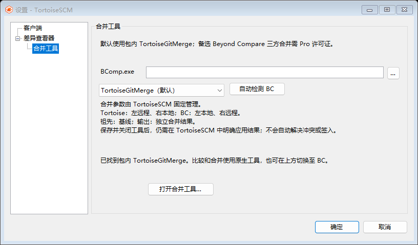
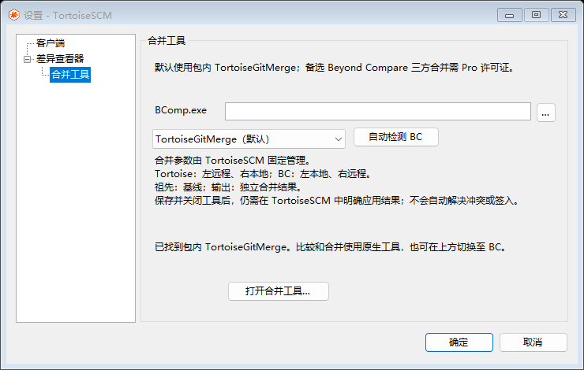

# 默认 Tortoise 工具与安装包验证（2026-09-29）

## 行为

- 完整安装包默认使用官方 TortoiseGitMerge 2.19.0.0 执行双文件比较和三方合并；另含 TortoiseGitUDiff，用于直接打开统一差异文件。保留官方文件名称，不新增 SCM 补丁应用流程。
- 设置的差异查看器/合并工具下拉框同步选择 TortoiseGitMerge 或 Beyond Compare。新配置与旧自动配置采用原生默认；显式外部 BC 路径及新保存的 BC 选择保留。BC 三方合并仍需 Pro。
- 工作文件、历史、暂存集及 Standard/Partial 三方输入继续使用已有身份核验和准备流程。原生参数明确映射 base/local/remote/merged，比较只读，合并结果独立保存。关闭工具不会自动应用或签入；取消也不终止编辑器，不提前删除输入文件。
- TortoiseGitMerge/TortoiseGitUDiff 的签名验证为 Valid；同包包含应用本地依赖、GPL 许可证和固定发布版本源码。原生源码来自 `54e40c426abcd38f93cd7f2bbafd9b1206696912`，递归导出固定子模块，包括嵌套子模块；27,701 个文件，ZIP 完整性检查通过。源码 ZIP SHA-256：`91315a0dd21459e6359169c9fa952538ab6fd8c72bf7d259f1e568fbab94c74a`。

## 验证

| 检查 | 结果与证据 |
| --- | --- |
| Release 完整回归 | `build-tortoisescm.ps1 -Test` 成功；`bin/TortoiseSCM/qa/tortoise-default-regression.log`。包括后端、CLI、生产 Shell DLL 和 WinForms GUI 回归。 |
| 最终生产构建 | 成功；`bin/TortoiseSCM/qa/tortoise-tools-final-build.log`。 |
| 原生工具配置及会话 | 17 项通过：默认/迁移/保存、Unicode 与特殊路径、实际子进程参数、三方角色、取消后等待窗口退出、原生错误码不误当作 BC 差异码。会话测试使用受控替身进程，不等同于第三方 GUI 编辑。 |
| BC 配置回归 | 最终重新编译执行 40 项通过；BC 进程/工作文件/历史/暂存集回归在完整套件中通过。 |
| 设置窗口 | 76 项通过；普通与最小尺寸截图目视核对无截断。 |
| BC 打包和迁移 | 39 / 35 项通过；`tortoise-tools-bc-package-final.log`、`tortoise-tools-bc-migration.log`。 |
| 真实安装器 | 隔离 TestSetup 的 38 项通过：安装、内置工具哈希、默认/BC/切回原生、实际 native diff 生成、旧 Shell DLL 占用时升级、同版本重装、卸载失败与重试、正式安装保持不变。日志 `tortoise-tools-installer-final.log`；补齐嵌套源码后的复测日志 `tortoise-tools-installer-complete-source.log`。 |
| 安装事务 | 38 项通过：损坏 ZIP、哈希篡改、路径穿越拒绝、已加载文件保护、保留用户文件、清理失败报告与重试。`tortoise-tools-bridge.log`。 |

以上日志位于 `bin/TortoiseSCM/qa/`。测试未改动正式安装、Explorer 注册或用户工具设置。最终 Setup 由同一打包流程生成，源提交记录在包清单中；安装包和 ZIP 另有 SHA-256 文件。

## 未验收边界

这次没有声称完成真实桌面 Explorer 点击、第三方编辑器手工三方编辑/保存/放弃或独立干净 Windows 机器验证。原生运行验证是在隔离安装目录中执行真实 TortoiseGitMerge 的 `/createunifieddiff`，证明随包运行文件能启动并生成差异；GUI 布局验证为真实 WinForms 控件测试与截图。TortoiseGitUDiff 已校验并随包安装，未做桌面交互验收。
